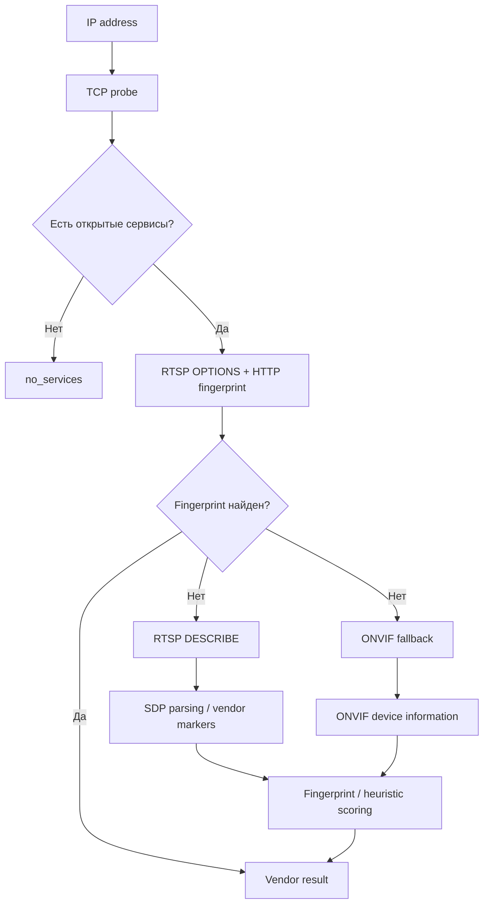
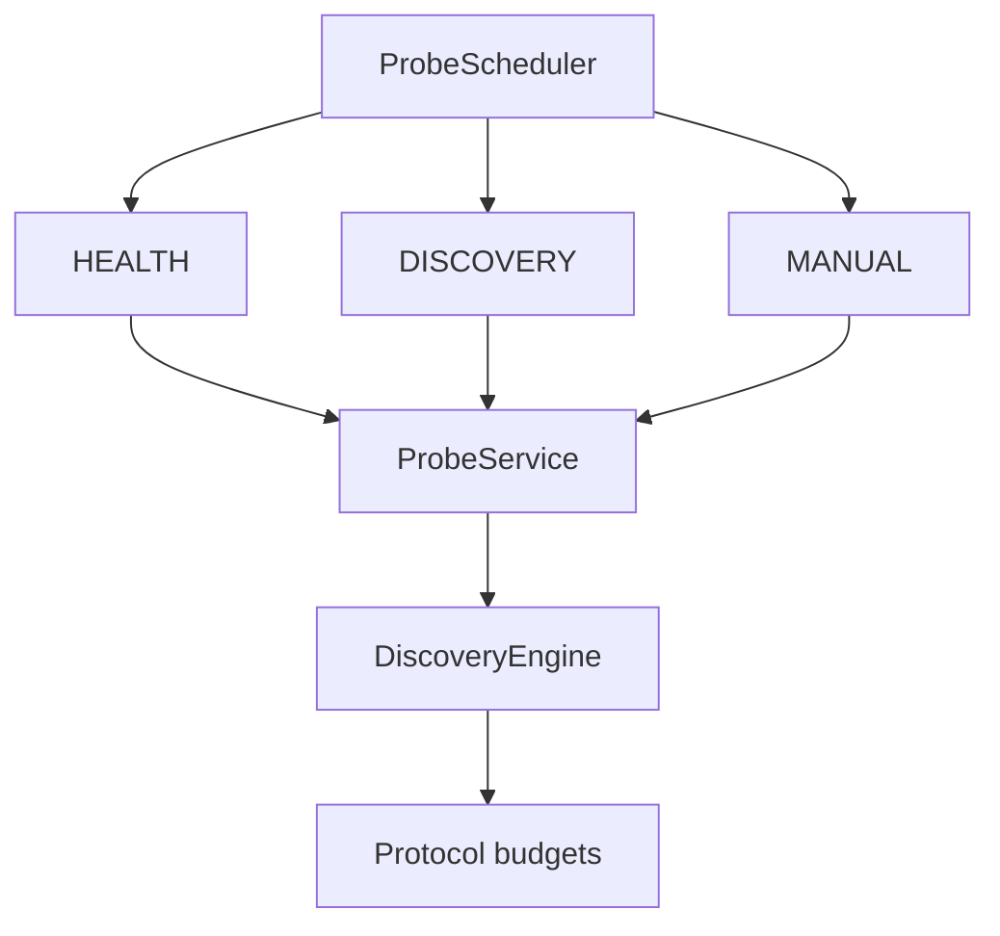
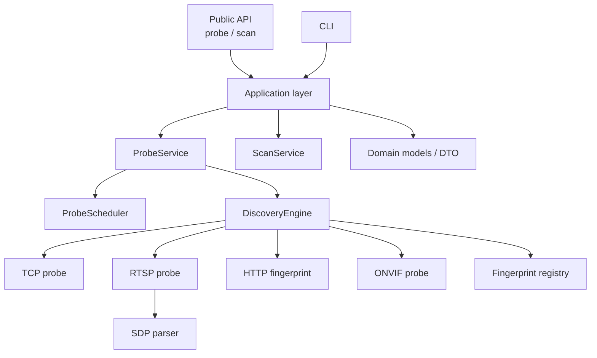

# camera-probe

Асинхронная Python-библиотека и CLI для обнаружения, идентификации и диагностики IP-камер, NVR и PTZ-устройств.

Проект ориентирован на массовое сетевое обнаружение камер и использование в inventory, мониторинге и VMS/NVR-системах. Архитектура разделяет публичный API, application services, domain-модели и инфраструктурные protocol probes.

## Что умеет

- обнаруживать устройства по IP и CIDR;
- выполнять bounded TCP discovery;
- определять производителя по RTSP, HTTP, ONVIF и fingerprint/evidence;
- поддерживать Hikvision, Dahua, Axis, Uniview, Xiongmai и другие fingerprint'ы;
- получать RTSP `OPTIONS` и, при необходимости, ограниченный `DESCRIBE`/SDP;
- выполнять HTTP fingerprinting;
- использовать ONVIF multicast/unicast/HTTPS fallback и получать device information;
- возвращать confidence score, method, evidence и диагностический status;
- сканировать большие CIDR асинхронным bounded worker pool;
- ограничивать сетевую нагрузку process-wide budget'ами;
- выполнять health/discovery/manual probes через priority scheduler;
- корректно обрабатывать timeout, cancellation, socket cleanup и конкурентный доступ;
- использовать один application graph для публичных `probe()` и `scan()`.

## Требования

- Python 3.10+
- Linux, macOS или Windows
- доступ к целевой сети для TCP/HTTP/RTSP/ONVIF probing

Версии Python 3.10, 3.11 и 3.12 являются поддерживаемыми целями проекта.

## Установка

Из PyPI:

```bash
pip install camera-probe
```

Из исходников:

```bash
git clone https://github.com/drycov/camera-probe.git
cd camera-probe
pip install -e .
```

Для ONVIF:

```bash
pip install -e '.[onvif]'
```

Зависимости базового пакета включают `aiohttp`, `requests`, `urllib3`, `cachetools` и `colorama`. ONVIF-интеграция вынесена в optional dependency `onvif-zeep`.

## Быстрый старт

### Python API: одна камера

```python
import asyncio
from camera_probe import probe


async def main():
    result = await probe(
        ip="192.168.1.64",
        username="admin",
        password="12345",
    )

    print("IP:", result.ip)
    print("Vendor:", result.vendor)
    print("Confidence:", result.confidence)
    print("Status:", result.status)


asyncio.run(main())
```

### Python API: CIDR

`scan()` возвращает `AsyncIterator[ProbeResult]`, поэтому результаты можно обрабатывать потоково и не материализовать весь диапазон адресов в памяти.

```python
import asyncio
from camera_probe import scan


async def main():
    async for result in scan(
        cidr="10.165.64.0/24",
        username="admin",
        password="12345",
        timeout=5.0,
        concurrency=20,
    ):
        print(result.ip, result.vendor, result.confidence, result.status)


asyncio.run(main())
```

### Публичные экспорты

```python
from camera_probe import (
    probe,
    scan,
    ProbeResult,
    NetworkInfo,
    NtpInfo,
)
```

`application/*`, `bootstrap/*` и `infrastructure/*` являются внутренними слоями и не считаются стабильным публичным API.

## Как работает discovery

Discovery построен как последовательность дешёвых проверок с ограниченным переходом к дорогим операциям.



### Фаза 1 — TCP

Сначала проверяются известные RTSP и HTTP-порты. TCP probe имеет собственный concurrency budget и timeout на соединение.

Используемые группы портов:

- RTSP: `554`, `8554`, `10554`
- HTTP: `80`, `81`, `8080`, `8000`, `8888`, `443`

### Фаза 2 — дешёвые fingerprints

Для найденных сервисов параллельно выполняются:

- RTSP `OPTIONS`;
- HTTP fingerprint.

Если evidence достаточно для fingerprint или heuristic результата, дальнейший дорогой fallback не требуется.

### Фаза 3 — RTSP DESCRIBE

Если производитель не определён, выполняется RTSP `DESCRIBE`.

Количество RTSP-портов для DESCRIBE ограничено. По умолчанию используется максимум **один** кандидат. Это предотвращает умножение зависающих RTSP-соединений при массовом discovery.

SDP анализируется на vendor markers и используется как evidence для определения производителя.

### Фаза 4 — ONVIF fallback

При отсутствии достаточного RTSP/HTTP evidence может использоваться ONVIF:

1. multicast discovery;
2. извлечение XAddr;
3. при необходимости unicast/HTTPS probing;
4. получение device information;
5. определение производителя по manufacturer/model.

ONVIF credentials передаются явно в fallback и не зависят от внешнего mutable scope.

## Confidence и evidence

Результат discovery содержит не только производителя, но и диагностическую информацию, позволяющую понять, почему был выбран результат.

Основные источники confidence:

| Evidence | Базовый confidence |
|---|---:|
| RTSP SDP fingerprint | 0.95 |
| HTTP API fingerprint | 0.90 |
| ONVIF device information | 0.85 |
| RTSP server heuristic | 0.70 |
| HTTP server heuristic | 0.45 |

Heuristic результат принимается при confidence `>= 0.85` либо при наличии разобранного RTSP SDP.

В evidence могут присутствовать RTSP server/port, HTTP markers, SDP parsed data, ONVIF XAddr/device information и heuristic path.

## Статусы discovery

Discovery не должен блокировать весь процесс из-за одного недоступного устройства.

Основные статусы:

- `ok` — устройство идентифицировано;
- `no_services` — проверенные TCP-порты не обнаружили сервисов;
- `unknown` — сервисы есть, но производитель не определён;
- `timeout` — превышен общий deadline discovery;
- `error` — непредвиденная ошибка discovery.

`asyncio.CancelledError` не превращается в успешный результат и передаётся вызывающему коду.

## Process-wide concurrency budget

Локальный параметр `scan(..., concurrency=N)` ограничивает число одновременно обрабатываемых адресов конкретным scanner'ом. Дополнительно discovery использует **process-wide budget**, общий для всех экземпляров `DiscoveryEngine` внутри процесса.

Это важно для VMS/inventory-систем, где одновременно могут работать несколько event loop, worker'ов или экземпляров сервиса.

Текущие значения по умолчанию:

| Ресурс | Переменная окружения | Default |
|---|---|---:|
| Полный discovery | `CAMERA_PROBE_MAX_CONCURRENT` | 16 |
| TCP connections | `CAMERA_PROBE_MAX_TCP` | 32 |
| RTSP operations | `CAMERA_PROBE_MAX_RTSP` | 8 |
| HTTP sessions | `CAMERA_PROBE_MAX_HTTP` | 4 |
| ONVIF sessions | `CAMERA_PROBE_MAX_ONVIF` | 4 |

Пример настройки:

```bash
export CAMERA_PROBE_MAX_CONCURRENT=16
export CAMERA_PROBE_MAX_TCP=32
export CAMERA_PROBE_MAX_RTSP=8
export CAMERA_PROBE_MAX_HTTP=4
export CAMERA_PROBE_MAX_ONVIF=4
```

Budget реализован через `threading.BoundedSemaphore`, а ожидание слота не блокирует worker thread. Поэтому ограничения не привязаны к конкретному `asyncio` event loop и могут использоваться несколькими event loop в одном процессе.

> Важно: `scan(concurrency=20)` не означает 20 одновременных RTSP-соединений. Protocol budgets дополнительно ограничивают фактическую нагрузку.

## Priority scheduler

Application layer содержит bounded priority scheduler для трёх типов операций:



Приоритеты:

| Тип | Приоритет |
|---|---:|
| `HEALTH` | 10 |
| `DISCOVERY` | 20 |
| `MANUAL` | 30 |

Меньшее значение означает более высокий приоритет.

`ProbeService` предоставляет специализированные методы:

```python
await service.health_probe(request)
await service.discovery_probe(request)
await service.manual_probe(request)
```

Обычный `probe(request)` по умолчанию относится к `DISCOVERY`.

Scheduler создаёт coroutine только в момент фактического запуска job. Это позволяет отменять ожидающую в очереди операцию без утечки un-awaited coroutine.

## Обратная совместимость

Изменения scheduler не ломают существующий код:

- `ProbeService` можно создавать без scheduler — сохраняется прямой режим;
- `ProbeScheduler.submit()` принимает как factory, так и старый awaitable-формат;
- публичные `probe()` и `scan()` сохраняют прежнюю модель использования;
- scheduler включается на уровне application bootstrap, а не требует изменения существующих вызовов.

Чтобы вернуть прямой режим в application bootstrap:

```bash
export CAMERA_PROBE_ENABLE_PRIORITY_SCHEDULER=0
```

По умолчанию scheduler включён.

## Cancellation, deadlines и cleanup

Каждый protocol probe должен соблюдать три контракта:

1. **timeout/deadline** — отдельный сетевой probe не должен ждать бесконечно;
2. **cancellation** — отмена задачи должна распространяться наружу;
3. **cleanup** — сокеты, semaphore slots и другие ресурсы освобождаются в `finally`/context manager.

У discovery есть два уровня ограничения времени:

- `timeout_per_port` — timeout отдельного сетевого probe;
- `max_total_timeout` — общий deadline всей discovery операции.

Это особенно важно при сканировании недоступных IP, firewall drop, зависших RTSP endpoints и устройств с нестандартным поведением TCP.

## Защита от гонок

В текущей реализации устранены основные shared-state race conditions:

- process-wide budget не зависит от event loop;
- discovery statistics защищены `threading.Lock`;
- HTTP shared state/cache защищены от конкурентной модификации;
- scanner использует bounded workers и потоковую выдачу результатов;
- callback exception не должен уничтожать worker pool;
- RTSP resources закрываются при normal completion, timeout и cancellation;
- ONVIF credentials передаются через параметры вызова;
- application API строит один общий `ProbeService`/`DiscoveryEngine` graph.

## CLI

### Probe одной камеры

```bash
camera-probe probe --ip 192.168.1.64
```

С credentials:

```bash
camera-probe probe \
  --ip 192.168.1.64 \
  --user admin \
  --password '12345'
```

JSON:

```bash
camera-probe probe --ip 192.168.1.64 --json
```

Force mode:

```bash
camera-probe probe --ip 192.168.1.64 --user admin --password '12345' --force
```

Предпочтение force probe при наличии credentials:

```bash
camera-probe probe --ip 192.168.1.64 --user admin --password '12345' --prefer-force
```

Повышение verbosity:

```bash
camera-probe -v probe --ip 192.168.1.64
camera-probe -vv probe --ip 192.168.1.64
```

### Scan CIDR

```bash
camera-probe scan 10.165.64.0/24
```

С credentials и ограничением локальной concurrency:

```bash
camera-probe scan 10.165.64.0/24 \
  --user admin \
  --password '12345' \
  --timeout 5 \
  --concurrency 20
```

JSON:

```bash
camera-probe scan 10.165.64.0/24 --json
```

## Архитектура проекта



Основные уровни:

```text
src/camera_probe/
├── api.py                         # стабильный публичный API
├── application/
│   ├── dto/                       # ProbeRequest / ScanRequest
│   └── services/
│       ├── probe_service.py       # orchestration probe
│       ├── probe_scheduler.py     # priority scheduling
│       ├── probe_priority.py      # HEALTH/DISCOVERY/MANUAL
│       └── scan_service.py        # bounded CIDR scan
├── bootstrap/                     # сборка application graph
├── domain/
│   ├── models/                    # ProbeResult, NetworkInfo, NtpInfo, ...
│   └── ports/                     # application/domain contracts
├── infrastructure/
│   ├── discovery/                 # TCP/RTSP/HTTP/ONVIF
│   ├── fingerprints/              # vendor fingerprints
│   ├── network/                   # network extractors/registry
│   ├── adapters/                  # vendor adapters
│   └── logging/                   # logging setup
└── interface/
    └── cli/                       # command line interface
```

## ProbeService

`ProbeService` является application-level orchestration point.

Типичный путь:

```text
ProbeRequest
    │
    ▼
priority scheduler
    │
    ▼
DiscoveryEngine
    │
    ├── discovery
    ├── vendor adapter (если найден)
    └── force fallback (если разрешён)
    │
    ▼
ProbeResult
```

Для `force=True` при наличии credentials возможен force-first путь. Параметр `prefer_force=True` позволяет предпочесть force probe при наличии credentials, не меняя публичный контракт.

## Fingerprints и adapters

Производитель определяется не одним жёстко зашитым условием. Discovery собирает evidence, после чего `FingerprintRegistry` пытается найти зарегистрированный fingerprint.

При отсутствии точного fingerprint используется heuristic scoring.

Infrastructure также содержит расширяемые network extractors и vendor adapters. Это позволяет добавлять поддержку новых производителей без переноса protocol-specific кода в публичный API.

## Конфигурация

Основные runtime-настройки discovery передаются параметрами API или переменными окружения.

### API timeout

```python
await probe(
    ip="192.168.1.64",
    timeout=5.0,
)
```

### Scan concurrency

```python
async for result in scan(
    cidr="10.0.0.0/24",
    concurrency=20,
):
    ...
```

### Process-wide budgets

```bash
CAMERA_PROBE_MAX_CONCURRENT=16
CAMERA_PROBE_MAX_TCP=32
CAMERA_PROBE_MAX_RTSP=8
CAMERA_PROBE_MAX_HTTP=4
CAMERA_PROBE_MAX_ONVIF=4
```

### Priority scheduler

```bash
CAMERA_PROBE_ENABLE_PRIORITY_SCHEDULER=1
```

Значения `1`, `true`, `yes`, `on` включают scheduler. `0` отключает его и возвращает прямой режим `ProbeService`.

## Разработка

Установка dev-зависимостей:

```bash
pip install -e '.[dev]'
```

Проверка тестов:

```bash
python -m pytest
```

Ruff:

```bash
ruff check .
```

Основная политика проекта — не допускать неограниченного роста сетевой concurrency. Новые protocol probes должны использовать существующие budget/deadline/cancellation механизмы, а не создавать собственные неограниченные worker pools.

## Надёжность при массовом сканировании

Архитектура рассчитана на сценарий, в котором одновременно проверяются сотни адресов и параллельно работают другие операции.

Ключевые ограничения:

```text
CIDR scan concurrency
        │
        ▼
ProbeScheduler
        │
        ▼
Process-wide discovery budget
        │
   ┌────┼────┬─────┐
   ▼    ▼    ▼     ▼
  TCP  RTSP HTTP  ONVIF
```

Таким образом, увеличение `scan --concurrency` не должно автоматически приводить к пропорциональному увеличению числа TCP/RTSP/HTTP/ONVIF операций.

## Лицензия

MIT License © Denis Rykov

## Ссылки

- Репозиторий: https://github.com/drycov/camera-probe
- Issues: https://github.com/drycov/camera-probe/issues
