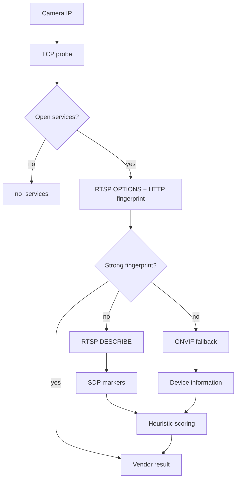

# camera-probe

**camera-probe** — асинхронная Python-библиотека и CLI для обнаружения, идентификации и диагностики IP-камер, NVR и PTZ.

Проект построен по Clean Architecture и рассчитан на inventory, мониторинг и массовое сканирование сетей.

## Возможности

- Автоопределение вендора: Hikvision, Dahua, Axis, Uniview, Xiongmai и др.
- RTSP / HTTP / ONVIF probing.
- Получение сетевой информации и NTP.
- Confidence score и диагностические evidence.
- Асинхронное сканирование CIDR.
- Расширяемые adapters / extractors / fingerprints.
- Общий API для CLI и библиотеки.

## Установка

```bash
pip install camera-probe
```

Из исходников:

```bash
git clone https://github.com/drycov/camera-probe.git
cd camera-probe
pip install -e .
```

## Быстрый старт

### Один IP

```python
import asyncio
from camera_probe import probe


async def main():
    result = await probe(
        ip="192.168.1.64",
        username="admin",
        password="12345",
    )
    print(result.vendor, result.confidence)


asyncio.run(main())
```

### CIDR

```python
import asyncio
from camera_probe import scan


async def main():
    async for result in scan(
        cidr="10.165.64.0/24",
        username="admin",
        password="12345",
        concurrency=20,
    ):
        print(result.ip, result.vendor, result.confidence)


asyncio.run(main())
```

## Архитектура discovery

Discovery разделён на дешёвую фазу fingerprinting и дорогой fallback:



RTSP DESCRIBE не выполняется для каждого открытого RTSP-порта: по умолчанию discovery ограничивается одним RTSP-портом. Это существенно снижает количество зависающих соединений при массовом сканировании.

## Process-wide concurrency budget

Помимо `scan(..., concurrency=N)` существует глобальный budget на уровне процесса. Он нужен потому, что несколько `ProbeService` / event loop / worker-потоков не должны независимо создавать сотни сетевых соединений.

Значения по умолчанию:

| Ресурс | Лимит |
|---|---:|
| Одновременные camera discovery | 16 |
| TCP connections | 32 |
| RTSP operations | 8 |
| HTTP discovery sessions | 4 |
| ONVIF fallback sessions | 4 |

Лимиты задаются переменными окружения:

```bash
CAMERA_PROBE_MAX_CONCURRENT=16
CAMERA_PROBE_MAX_TCP=32
CAMERA_PROBE_MAX_RTSP=8
CAMERA_PROBE_MAX_HTTP=4
CAMERA_PROBE_MAX_ONVIF=4
```

Budget не использует `asyncio.Semaphore` глобально: вместо этого применяется event-loop-independent механизм на базе thread semaphore. Это позволяет безопасно разделять лимиты между несколькими event loop в одном процессе.

## Таймауты

У каждого discovery есть два уровня защиты:

1. `timeout_per_port` — ограничивает отдельный сетевой probe.
2. `max_total_timeout` — жёсткий deadline всей discovery операции.

Отмена задачи (`asyncio.CancelledError`) не превращается в успешный результат и корректно распространяется наружу.

## Защита от гонок и утечек

В discovery layer устранены основные источники гонок:

- статистика защищена `threading.Lock` и не привязана к event loop;
- HTTP base URL cache и shared session защищены от конкурентной модификации;
- ScanService использует bounded worker pool без материализации всего CIDR в очередь;
- callback exception не уничтожает scanner workers;
- RTSP sockets закрываются в `finally`, включая timeout/cancellation;
- ONVIF credentials передаются явно в fallback вместо обращения к переменным из внешнего scope;
- приложение использует один ProbeService/DiscoveryEngine graph вместо дублирующего bootstrap.

## Публичный API

```python
from camera_probe import (
    probe,
    scan,
    ProbeResult,
    NetworkInfo,
    NtpInfo,
)
```

### `probe(...)`

```python
await probe(
    ip: str,
    username: str | None = None,
    password: str | None = None,
    timeout: float = 5.0,
    force: bool = False,
    prefer_force: bool = False,
)
```

### `scan(...)`

```python
async for result in scan(
    cidr: str,
    username: str | None = None,
    password: str | None = None,
    timeout: float = 5.0,
    concurrency: int = 20,
):
    ...
```

`application/*` и `infrastructure/*` не являются публичным API.

## CLI

```bash
camera-probe probe --ip 192.168.1.64 --user admin --password 12345
camera-probe probe --ip 192.168.1.64 --json
camera-probe scan 10.165.64.0/24 --user admin --password 12345
```

## Надёжность

Discovery возвращает диагностические статусы вместо зависания всей операции:

- `ok`
- `no_services`
- `unknown`
- `timeout`
- `error`

Все protocol probes должны соблюдать cancellation, deadline и cleanup контракт.

## Разработка

Проект использует Python 3.10+.

Перед PR необходимо проверить:

```bash
python -m pytest
ruff check .
```

## Roadmap

- Расширение fingerprint registry.
- Prometheus / JSON Schema export.
- Более глубокий ONVIF support.
- Дополнительные vendor-specific probes.
- Метрики бюджета: saturation, wait time, protocol failures.

## Лицензия

MIT License © Denis Rykov
